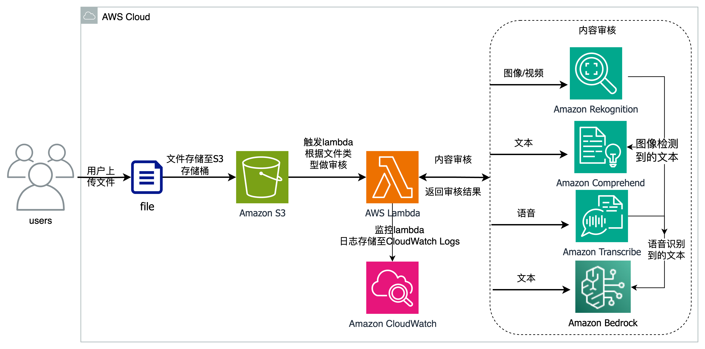

# 基于亚马逊云科技的AIML服务实现高效智能化内容审核

## 简介
随着生成式人工智能(Generative AI, GenAI)技术的兴起，各类基于GenAI的应用和服务层出不穷，覆盖电商、娱乐媒体、零售、金融、医疗等广泛行业。GenAI改变了传统的人工生产内容的方式，大模型可以根据提示实现文本、图像、音频和视频等内容的生成。相比传统决策式AI，GenAI具有创新性、高效性和个性化等特点，但是现阶段也存在生成内容可控性的问题。GenAI生成的内容可能包含误导信息、有害内容等，需要建立内容审核机制进行管控。与此同时，面向用户的GenAI服务也会涉及大量用户上传内容，这些UGC同样需要审核过滤掉违规违法信息。内容审核涉及文本、图像、视频多等模态数据处理，还需要结合行业规范、法律法规等方面进行综合判断。GenAI时代内容审核技术和服务将是非常值得关注的热点。
在这篇博文中，我们将探讨如何使用亚马逊云科技提供的一系列托管人工智能服务Amazon Rekognition ，Amazon Comprehend，Amazon Transcribe和 Amazon Bedrock以及其他技术，打造自动化的智能化内容审核系统包括图像、视频、文本和音频审核工作流程，及时过滤不合适的内容，给用户带来更好的体验。

## 免责申明
建议测试过程中使用此方案，生产环境使用请自行考虑评估。
欢迎联系参与方案共建和提交方案需求, 也欢迎在 github 项目 issue 中留言反馈。

## 整体架构

1. 用户上传各类型文件（包括：文本、图像、视频、语音）到Amazon S3存储桶；
2. 文件成功上传存储桶后，监测到 S3 存储桶的事件变化（put object操作），会自动触发AWS Lambda；
3. AWS Lambda根据文件类型执行相应的内容审核，如果有一些基于规则的内容审核功能也可以在Lambda内处理：
    1. 使用Amazon Rekognition进行图像/视频数据的内容审核，包括：
        1. 内容审核API detect_moderation_labels对不合规图像进行分类；
        2. 人脸分析API detect_faces分析图像中的人脸相关信息；
    2. 使用Amazon Comprehend对文本数据进行文本情绪分析和个人信息提取，包括：
        1. 毒性检测API  detect-toxic-content分析文本中的不合适内容，检测是否有包含相关"PROFANITY"内容；
        2. 敏感信息检测detect_pii_entities，只保留检测是否包含年龄信息；
    3. 使用Amazon Bedrock Claude v2对文本数据进行内容审核；
4. 通过Amazon CloudWatch监控AWS Lamnda的每次执行，并将日志记录到CloudWatch Logs中。

## 实验步骤
如果通过lambda的方式测试，大概步骤如下：
1. 环境准备：创建S3存储桶，创建 IAM 角色和 BedRock策略
2. 创建并配置Lambda函数
3. 导入Lambda代码并部署Lambda函数
4. 上传文件到S3存储桶，检查测试结果

如果把功能集成到自己的环境可以参考sample code：
1. 环境准备：创建S3存储桶，创建 IAM 角色和 BedRock策略
2. 创建并运行对应的python 函数
3. 查看审核结果

## 文件说明
- src中lambda_func为lambda完整代码，sample_code为各个类型数据检测的python代码
- test_data 和 test_results 分别为实验中用到的测试数据和测试结果

## 参考文档
- Rekognition 做图像内容审核：https://aws.amazon.com/cn/rekognition/content-moderation/
- Comprehend 做文本内容审核：https://docs.aws.amazon.com/zh_cn/comprehend/latest/dg/trust-safety.html
- Transcribe 做音频内容审核：https://docs.aws.amazon.com/transcribe/latest/dg/toxicity.html
- Bedrock 文档：https://docs.aws.amazon.com/bedrock/latest/userguide/what-is-bedrock.html