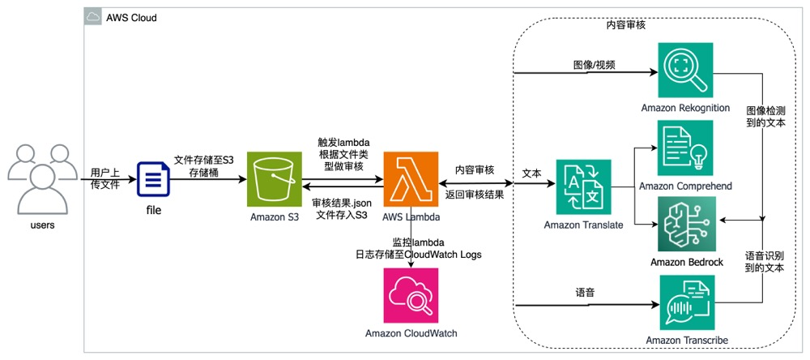

 # Multi-Modal Intelligent Content Moderation

This repository contains the implementation of the Multi-Modal Intelligent Content Review based on AWS AI services. For detailed deployment steps and additional information, please refer to our [blog post](https://aws.amazon.com/cn/blogs/china/multi-modal-intelligent-content-review-based-on-aws-ai-services/) on AWS.

## Architecture Overview

## Deployment Steps

### Step 1: Bedrock Permission Application

### Step 2: Create S3 Bucket, Lambda Setup

### Step 3: Deploy Lambda Functions

...

For more details and insights, please visit our [blog post](https://aws.amazon.com/cn/blogs/china/multi-modal-intelligent-content-review-based-on-aws-ai-services/).

